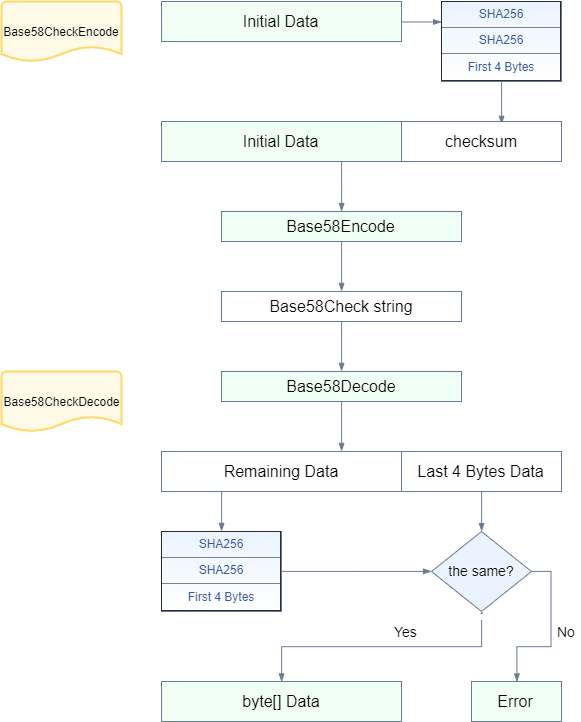

# Encoding Algorithm

##  Base58

Base58 is a group of encoding/decoding schemes used to switch data between binary format (hexdecimal) and alphanumeric text format (ASCII). Base58 enables data compressing, is easy to identify, and is suitable for constructing encoding mechanism of transmission system that is anti-auto-monitoring. However, lack of verification makes it not able to detect error during transmission. Thus Base58Check, an improved scheme is required.

The Base58's alphabet includes numbers (From 1 to 9), and English letters except O (uppercase o) / I (uppercase i) / l (lowercase L). These letters are omitted to avoid confusion.

Neo's Base58 alphabet: **123456789ABCDEFGHJKLMNPQRSTUVWXYZabcdefghijkmnopqrstuvwxyz**

Interface definition：

1. Encoding method: Encoding byte[] format data into Base58 string format

   ```c#
   string Encode(byte[] input)
   ```
   
2. Decoding Method: Decoding Base58 string format data into byte[] format

   ```c#
   byte[] Decode(string input)
   ```

**Encoding Steps**：

1.  Add 0x00 before byte[] data to generate a new byte array, and then reverse its order (little endian)

2.  Convert array data to a BigInteger object

3.  Convert the BigInteger format number to 58-based number according to Base58 alphabet

4.  Count the number of 0x00 in original byte array format data. At the head of the Base58 format data generated in step 3, for each 0x00, add a letter '1', which is the first character in Base58 alphabet

**Decoding Steps**：

1.  Convert the input string into BigInteger format according to Base58 alphabet.

2.  Convert from BigInteger format to byte[] format and then reverse the order to big endian.

3.  If byte[] format data's length is more than 1 & byte[0] = 0 & byte[1] >= 0x80, start from byte[1], otherwise start from byte[0] to get the decoded result.

4.  Count the number of the first letter of Base58 alphabet in original input data as count and remove leading zeros from the decoded data.

Example:

| String Content | byte[] |
| --- | --- |
| <nobr>AXaXZjZGA3qhQRTCsyG5uFKr9HeShgVhTF</nobr> |  [0x17, 0xad, 0x5c, 0xac, 0x59, 0x6a, 0x1e, 0xf6, 0xc1, 0x8a, 0xc1, 0x74, 0x6d, 0xfd, 0x30, 0x4f, 0x93, 0x96, 0x43, 0x54, 0xb5, 0x78, 0xa5, 0x83, 0x22] |

Scenarios：

Serves for Base58Check encoding / decoding method.

## Base58Check

Base58Check is an improved encoding / decoding method base on Base58. Base58Check solved the lack of checking mechanism in Base58, by adding hash value to original data as salt.


Interface definition:

1. Encoding method: encode byte array data into checkable Base58 string format

   ```c#
   string Base58CheckEncode(byte[] input)
   ```

2. Decoding method：decode checkable Base58 string data into byte array format

   ```c#
   byte[] Base58CheckDecode(string input)
   ```

**Encoding Steps**:

1.  Encode input byte array twice with Sha256 to get a hashed byte array. Take the first 4 bytes of the hash as checksum and append it to the end of original byte array.

2.  Use Base58 to encode the byte array including checksum to get corresponding encoded result.

**Decoding Steps**:

1. Use Base58 to decode input string to get byte array format decoded result.

2. Take the content of byte array except the last 4 bytes as data.

3. Encode data twice with SHA256 to get a hashed byte array. Check whether the first 4 bytes of the hashed value are identical with the last 4 bytes in byte array of step 1. If so, the decoded data is correct. Otherwise the data is corrupted.

   

   

Example:

| String content | byte[] |
| --- | --- |
| <nobr>AXaXZjZGA3qhQRTCsyG5uFKr9HeShgVhTF</nobr>   |  [0x17, 0xad, 0x5c, 0xac, 0x59, 0x6a, 0x1e, 0xf6, 0xc1, 0x8a, 0xc1, 0x74, 0x6d, 0xfd, 0x30, 0x4f, 0x93, 0x96, 0x43, 0x54, 0xb5] |

Scenarios：

- Import / export WIF format secret key

- Switch between contract script hash and address

- Import / export NEP2 format secret key